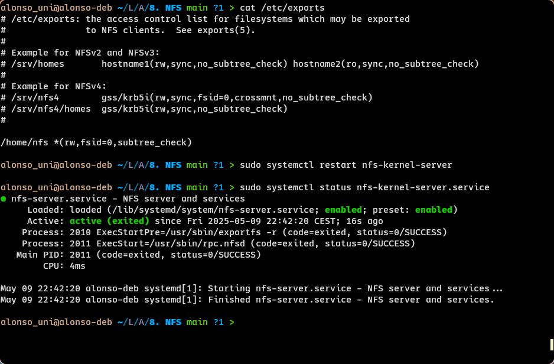
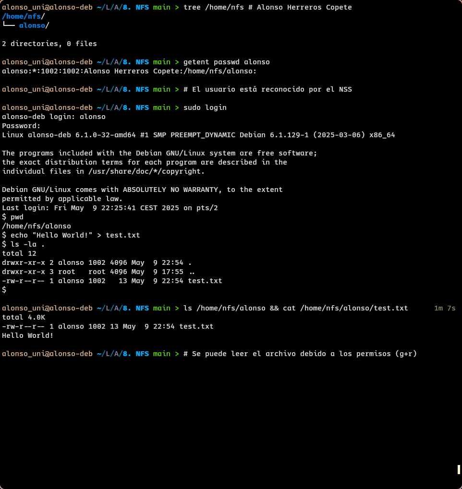
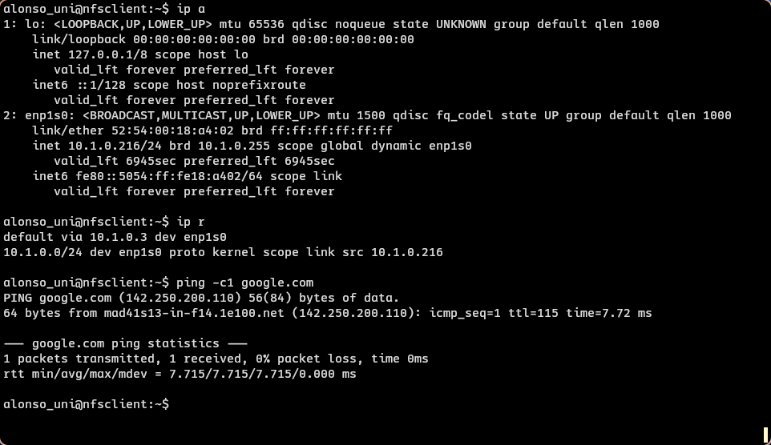
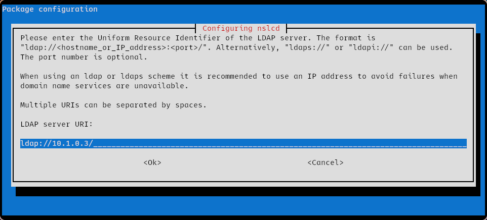
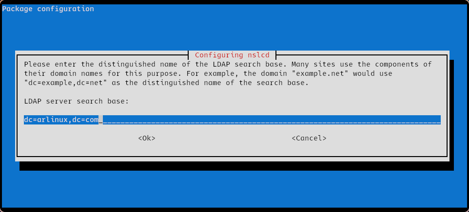
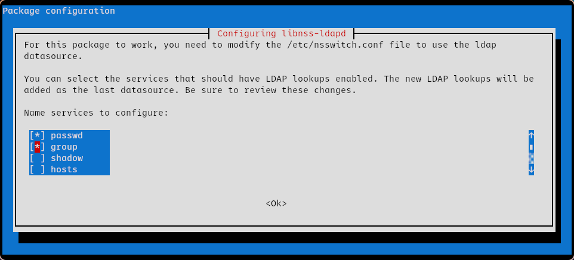
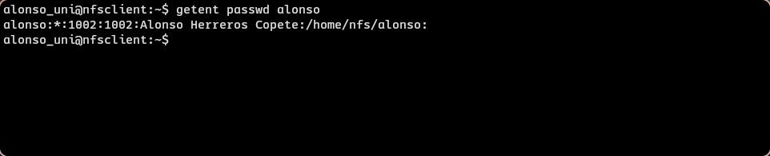
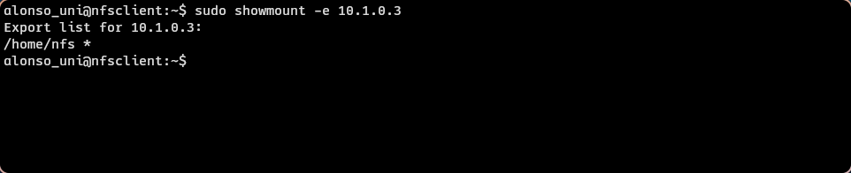

## Administración de Redes Linux

# Entregable 8: NFS

<!-- markdownlint-disable MD053 -->
[![CC BY-SA 4.0][shield-cc-by-sa]][cc-by-sa]
[![GITT][shield-gitt]][gitt]
[![Administración de Redes Linux][shield-lna]][lna]

## Introducción

Este documento contiene el registro del desarrollo de la actividad, incluyendo
las instrucciones principales, las decisiones, y los resultados.

## Preparación del servidor

Usaremos como servidor una máquina virtual con Debian 12 con un servidor
OpenLDAP, y `dnsmasq` actuando de DHCP y TFTP (la misma que para el resto de
entregables).

### Reconfiguración del servidor LDAP

Dado que el servidor LDAP estaba ya instalado y configurado con la base
`dc=marvel,dc=com`, lo primero que haremos será reconfigurarlo para que use la
base `dc=arlinux,dc=com`:

```sh
sudo dpkg-reconfigure slapd
```


### Configuración de NSS en el servidor

El paquete `libnss-ldapd` es un módulo de NSS (Name Service Switch, a cargo de
la **identificación** de usuarios) que nos permitirá identificar ciertas
entradas del servidor LDAP como *usuarios*.

```sh
sudo apt install libnss-ldapd
```

Durante la instalación, deberemos introducir el 'nombre de dominio' configurado
en el servidor LDAP, en este caso `arlinux.com`. También seleccionaremos las
opciones `passwd` y `group` cuando se presente la lista, como se muestra en la
siguiente captura de pantalla:


### Configuración de PAM en el servidor

También debemos instalar `libpam-ldapd`, un PAM (Pluggable Authentication
Module, a cargo de la **autenticación** de usuarios) que nos permitirá
autenticarnos como usuarios de un directorio LDAP.

```sh
sudo apt install libpam-ldapd
```

### Creación de usuario y directorio

A continuación, crearemos un usuario y su directorio personal en el servidor
LDAP.

#### Creación del usuario

Para este ejercicio crearemos una entrada en el servidor LDAP con el DN
`uid=alonso,dc=arlinux,dc=com` y la clase `posixAccount` (con todos los
atributos que requiere). El siguiente fichero LDIF contiene los datos
necesarios para la creación.

| [`ldap/alonso.ldif`](ldap/alonso.ldif) |
| -------------------------------------- |

```ldif
dn: uid=alonso,dc=arlinux,dc=com
objectClass: inetOrgPerson
objectClass: posixAccount
cn: Alonso Herreros Copete
sn: Herreros Copete
uid: alonso
uidNumber: 1002
gidNumber: 1002
homeDirectory: /home/nfs/alonso
```

Una vez definida la entrada, podemos crearla con el siguiente comando:

```sh
ldapadd -xWD "cn=admin,dc=arlinux,dc=com" -f ldap/alonso.ldif
```

Le asignaremos una contraseña usando el comando `ldappasswd`:

```sh
$ ldappasswd -xWD "cn=admin,dc=arlinux,dc=com" -S "uid=alonso,dc=arlinux,dc=com"
New password: 
Re-enter new password: 
Enter LDAP Password: 
```

#### Creación del directorio personal

El siguiente paso será crear el directorio `/home/nfs/alonso` y asignarle los
permisos adecuados. Como nombre de usuario dueño especificaremos `alonso`, por
supuesto, pero el grupo no tiene un nombre aparte de su valor numérico.
Usaremos el valor indicado en el fichero LDIF original (en este caso, `1002`).

```sh
sudo mkdir -p /home/nfs/alonso
sudo chown alonso:1002 /home/nfs/alonso
```

### Configuración de NFS en el servidor

El paquete `nfs-kernel-server` es el servidor NFS que usaremos.

```sh
sudo apt install nfs-kernel-server
```

La configuración que nos interesa está en el fichero `/etc/exports`, donde
indicaremos que queremos exportar el directorio `/home/nfs` añadiendo
la siguiente línea:

```exports
/home/nfs *(rw,fsid=0,subtree_check)
```

A continuación, reiniciaremos el servicio NFS para recargar la configuración:

```sh
sudo systemctl restart nfs-kernel-server
```

La siguiente captura de pantalla muestra la configuración, el reinicio y el
estado del servicio:



## Hito 1: Comprobación de acceso local

En este punto realizaremos una prueba de funcionalidad parcial, comprobando
si podemos iniciar sesión como el nuevo usuario `alonso` correctamente:



## Preparación del cliente

Como cliente usaremos una nueva máquina virtual con Debian 12, instalado usando
TFTP, configurado en el servidor en un ejercicio anterior. Su única interfaz de
red estará conectada a una red interna en la que la máquina servidor actúa de
*gateway*, servidor DHCP y servidor TFTP.

La interfaz está configurada en modo DHCP, y tiene salida al exterior a través
del servidor sin problema:



### Configuración de NSS en el cliente

Usaremos el mismo módulo NSS que en el servidor, `libnss-ldapd`, para
identificar los usuarios del servidor LDAP.

```sh
sudo apt install libnss-ldapd
```

Durante la instalación, deberemos introducir la URI el servidor LDAP. En este
caso, la máquina servidor está configurada estáticamente para obtener la IP
10.1.0.3, por lo que la URI del servidor será `ldap://10.1.0.3/`



También deberemos introducir la base de búsqueda LDAP, que en este caso es
`dc=arlinux,dc=com`.



Finalmente, seleccionaremos las opciones `passwd` y `group` cuando se presente
la lista de servicios.



Podemos comprobar que esta configuración se ha realizado correctamente usando
`getent`:



### Configuración de NFS en el cliente

El paquete `nfs-common` es el cliente NFS que usaremos.

```sh
sudo apt install nfs-common
```

Usando el comando `showmount`, podemos comprobar que el servidor NFS está
exportando el directorio `/home/nfs`:



A continuación, reiniciaremos la máquina cliente:

```sh
sudo reboot -h now
```

### Montaje del NFS en el cliente

#### Montaje manual

Se puede montar el NFS manualmente usando los siguientes comandos:

```sh
sudo mkdir -p /home/nfs
sudo mount -t nfs 10.1.0.3:/home/nfs /home/nfs
```

[shield-cc-by-sa]: https://img.shields.io/badge/License-CC%20BY--SA%204.0-lightgrey.svg
[shield-gitt]:     https://img.shields.io/badge/Degree-Telecommunication_Technologies_Engineering_|_UC3M-eee
[shield-lna]:       https://img.shields.io/badge/Course-Linux_Networks_Administration-eee

[cc-by-sa]: https://creativecommons.org/licenses/by-sa/4.0/
[gitt]:     https://uc3m.es/bachelor-degree/telecommunication
[lna]:       https://aplicaciones.uc3m.es/cpa/generaFicha?est=252&plan=445&asig=18467&idioma=2
