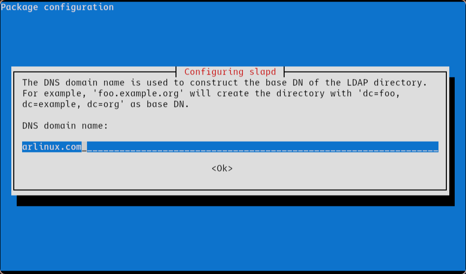
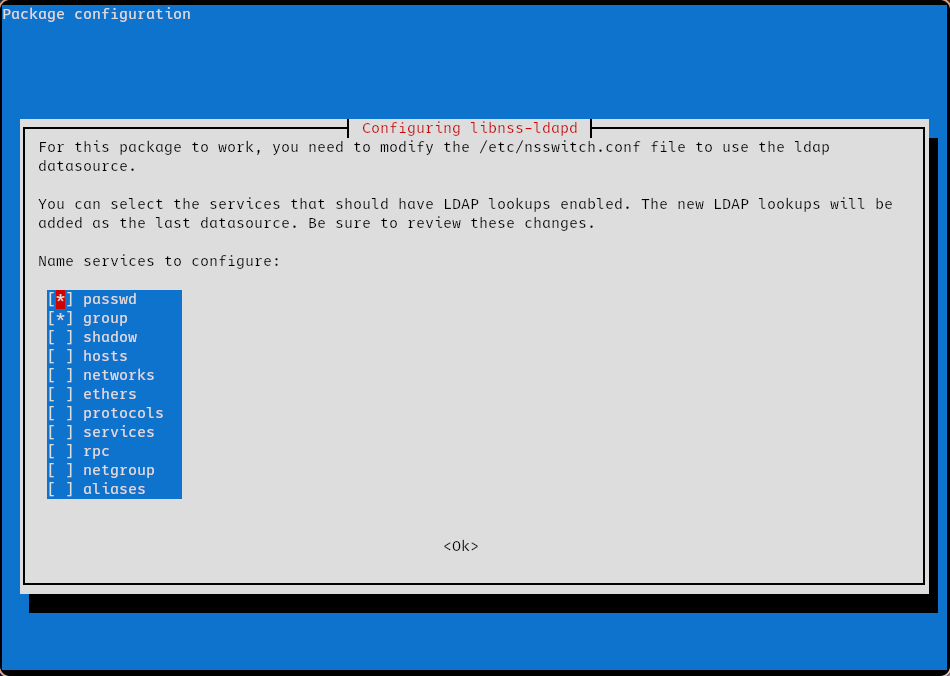

## Administración de Redes Linux

# Entregable 8: NFS

<!-- markdownlint-disable MD053 -->
[![CC BY-SA 4.0][shield-cc-by-sa]][cc-by-sa]
[![GITT][shield-gitt]][gitt]
[![Administración de Redes Linux][shield-lna]][lna]

## Introducción

Este documento contiene el registro del desarrollo de la actividad, incluyendo
las instrucciones principales, las decisiones, y los resultados.

## Preparación del servidor

Usaremos como servidor una máquina virtual con Debian 12 con un servidor
OpenLDAP, y `dnsmasq` actuando de DHCP y TFTP (la misma que para el resto de
entregables).

### Reconfiguración del servidor LDAP

Dado que el servidor LDAP estaba ya instalado y configurado con la base
`dc=marvel,dc=com`, lo primero que haremos será reconfigurarlo para que use la
base `dc=arlinux,dc=com`:

```sh
sudo dpkg-reconfigure slapd
```



### Configuración de NSS

El paquete `libnss-ldapd` es un módulo de NSS (Name Service Switch, a cargo de
la **identificación** de usuarios) que nos permitirá identificar ciertas
entradas del servidor LDAP como *usuarios*.

```sh
sudo apt install libnss-ldapd
```

Durante la instalación, deberemos introducir el 'nombre de dominio' configurado
en el servidor LDAP, en este caso `arlinux.com`. También seleccionaremos las
opciones `passwd` y `group` cuando se presente la lista, como se muestra en la
siguiente captura de pantalla:



### Configuración de PAM

El siguiente paquete a instalar es `libpam-ldapd`, un módulo de autenticación
que nos permitirá iniciar sesión usando una entrada en un servidor LDAP.

```sh
sudo apt install libpam-ldapd
```

### Configuración de NFS

El paquete `nfs-kernel-server` es el servidor NFS que usaremos.

```sh
sudo apt install nfs-kernel-server
```

[shield-cc-by-sa]: https://img.shields.io/badge/License-CC%20BY--SA%204.0-lightgrey.svg
[shield-gitt]:     https://img.shields.io/badge/Degree-Telecommunication_Technologies_Engineering_|_UC3M-eee
[shield-lna]:       https://img.shields.io/badge/Course-Linux_Networks_Administration-eee

[cc-by-sa]: https://creativecommons.org/licenses/by-sa/4.0/
[gitt]:     https://uc3m.es/bachelor-degree/telecommunication
[lna]:       https://aplicaciones.uc3m.es/cpa/generaFicha?est=252&plan=445&asig=18467&idioma=2
